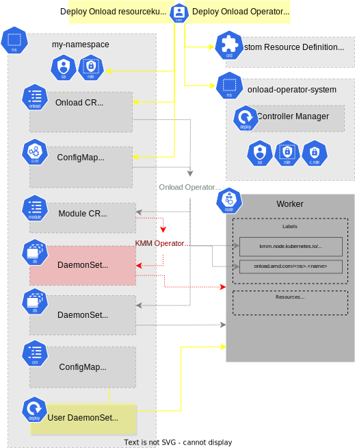
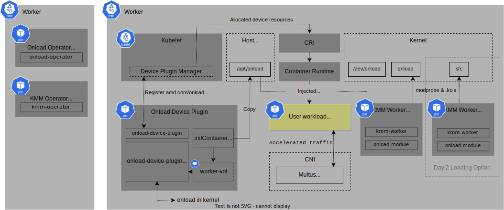

# KubernetesOnload™

Use OpenOnload® or EnterpriseOnload® to accelerate your workloads in Kubernetes and OpenShift clusters.

## Installation requirements

### Supported environment

* [OpenOnload](https://github.com/Xilinx-CNS/onload) (including EnterpriseOnload) 8.1+
* [AMD Solarflare](https://www.solarflare.com) hardware (`sfc`)
* OpenShift Container Platform (OCP) 4.10+ with
  * [Kernel Module Management (KMM) Operator](https://kmm.sigs.k8s.io/) 1.1 ([OpenShift documentation](https://docs.openshift.com/container-platform/4.14/hardware_enablement/kmm-kernel-module-management.html))
* Both restricted network or internet-connected clusters

Deployment can also be performed on Kubernetes 1.23+ but full implementation details are not currently provided.
The Onload Device Plugin is not currently designed for standalone deployment.

Please see [Release Notes](ReleaseNotes.md) for further detail on version compatibility and feature availability.

### Access to container images & configuration files

#### Terminal

Your terminal requires access to:

* Your cluster via `kubectl` or `oc`
* [This repository](https://github.com/Xilinx-CNS/kubernetes-onload)

This documentation standardises on `kubectl` but both are compatible: `alias kubectl=oc`.

Most users can benefit from the [provided container images](#provided-images) along with
[KMM's in-cluster `onload-module` builds](#onload-module-in-cluster-builds).
A more comprehensive development environment is required for special use cases, namely:

* [building bespoke `onload-module` images](#onload-module-pre-built-images) outside the cluster,
* [OpenShift MachineConfig for Day 0/1 sfc](#openshift-machineconfig-for-sfc),
* [developing Onload](#onload-source--onload-user), and/or
* [developing Onload Operator or Onload Device Plugin](#onload-operator--onload-device-plugin).

#### Cluster

Your cluster requires access to the following [provided container images](#provided-images):

* `onload-operator`
* `onload-device-plugin`
* `onload-user`
* `onload-source` (if in-cluster builds)
* `sfptpd` (optional)
* `sfnettest` (optional)
* KMM Operator & dependents
* DTK (if in-cluster builds on OpenShift)
  * OpenShift includes a `driver-toolkit` (DTK) image in each release. No action should be required.

The cluster also requires access to the following node-specific kernel module container image(s) which may be provided
externally or internally. If using [in-cluster builds](#onload-module-in-cluster-builds), push access to an internal
registry will be required. Otherwise, only pull access is required if these images are
[pre-built](#onload-module-pre-built-images).
Please see [Release Notes](ReleaseNotes.md) for further detail on feature availability.

* `onload-module`

When using [in-cluster builds](#onload-module-in-cluster-builds), other dependencies may be required depending on
the method selected. These may include `ubi-minimal` container image and
[UBI RPM repositories](https://access.redhat.com/articles/4238681).

### Provided Images

This repository's YAML configuration uses the following images by default:

* [`docker.io/onload/onload-operator`](https://hub.docker.com/r/onload/onload-operator)
* [`docker.io/onload/onload-device-plugin`](https://hub.docker.com/r/onload/onload-device-plugin)
* [`docker.io/onload/onload-source`](https://hub.docker.com/r/onload/onload-source)
* [`docker.io/onload/onload-user`](https://hub.docker.com/r/onload/onload-user)
* [`docker.io/onload/sfptpd`](https://hub.docker.com/r/onload/sfptpd)
* [`docker.io/onload/sfnettest`](https://hub.docker.com/r/onload/sfnettest)

For restricted networks these container images can be mirrored.

## Deployment

To accelerate a pod:

* Configure the [Onload Operator](#onload-operator)
* Configure an [Onload Custom Resource (CR)](#onload-custom-resource-cr)
* Configure a pod network with AMD Solarflare interfaces, ie. Multus [IPVLAN or MACVAN](docs/nad.md)
* Configure the [out-of-tree `sfc` module](#out-of-tree-sfc-kernel-module)
* [Configure your pods](#run-onloaded-applications) to use the resource provided by
  the [Onload Device Plugin](#onload-device-plugin) and the network

Kubernetes objects deployed (simplified):



Pods & devices on Nodes:



### Onload Operator

The Onload Operator follows the [Kubernetes Operator](https://kubernetes.io/docs/concepts/extend-kubernetes/operator/)
pattern which links a [Kubernetes Controller](https://kubernetes.io/docs/concepts/architecture/controller/),
implemented here in the `onload-operator` container image, to one or more Custom Resource Definitions (CRD),
implemented here in the `Onload` *kind* of CRD.

To deploy the Onload Operator, its controller container and CRD, run:

```sh
kubectl apply -k https://github.com/Xilinx-CNS/kubernetes-onload/config/default?ref=v3.0
```

This deploys the following by default:

* In Namespace [`onload-operator-system`](./config/default/kustomization.yaml) with prefix
  [`onload-operator-`](./config/default/kustomization.yaml):
  * [Onload CRD](config/crd/bases/onload.amd.com_onloads.yaml)
  * [Operator](config/manager/kustomization.yaml) version from DockerHub.
  * [RBAC](config/rbac) for these components

The Onload Operator will not deploy the components necessary for accelerating workload pods without
an `Onload` *kind* of Custom Resource (CR).

#### Local Onload Operator images in restricted networks

For restricted networks, the `onload-operator` and `onload-device-plugin` image locations will require changing from
their DockerHub defaults. To run the above command using locally hosted container images, open this repository
locally and use the [following overlay](config/samples/default-clusterlocal/kustomization.yaml):

```sh
git clone -b v3.0 https://github.com/Xilinx-CNS/kubernetes-onload && cd kubernetes-onload

cp -r config/samples/default-clusterlocal config/samples/my-operator
$EDITOR config/samples/my-operator/kustomization.yaml
kubectl apply -k config/samples/my-operator
```

### Onload Device Plugin

The Onload Device Plugin implements the [Kubernetes Device Plugin API](https://kubernetes.io/docs/concepts/extend-kubernetes/compute-storage-net/device-plugins/)
to expose a [Kubernetes Resource](https://kubernetes.io/docs/concepts/configuration/manage-resources-containers/)
named `amd.com/onload`.

It is distributed as the container image `onload-device-plugin` and is deployed and configured entirely by
the Onload Operator. Its image location is configured as an environment variable within the Onload Operator deployment
([see above](#local-onload-operator-images-in-restricted-networks)) and its ImagePullPolicy as part of
[Onload Custom Resource (CR)](#onload-custom-resource-cr) along with its other customisation properties.

### Onload Custom Resource (CR)

Instruct the Onload Operator to deploy the components necessary for accelerating workload pods by deploying
a `Onload` *kind* of Custom Resource (CR).

If your cluster is internet-connected OpenShift and you want to use in-cluster builds with the current version
of OpenOnload, run:

```sh
kubectl apply -k https://github.com/Xilinx-CNS/kubernetes-onload/config/samples/onload/overlays/in-cluster-build-ocp?ref=v3.0
```

This takes a [base `Onload` CR template](config/samples/onload/base/onload_v1alpha1_onload.yaml) and adds the
appropriate [image versions](config/samples/onload/overlays/in-cluster-build-ocp/kustomization.yaml) and
[in-cluster build configuration](config/samples/onload/overlays/in-cluster-build-ocp/patch-onload.yaml). To customise
this recommended overlay further, see the variant steps below.

The above overlay configures KMM to `modprobe onload` but `modprobe sfc` is also required.
Please see [Out-of-tree `sfc` module](#out-of-tree-sfc-kernel-module) for options.

> [!IMPORTANT]
> Due to Kubernetes limitations on label lengths, the combined length of the Name and Namespace of the Onload CR must be less than 32 characters.

#### In-cluster builds in restricted networks

In restricted networks or on other versions of Kubernetes, change the container image locations and build method(s)
to suit your environment. For example, to adapt the overlay
[in-cluster build on OpenShift in restricted network](config/samples/onload/overlays/in-cluster-build-ocp-clusterlocal):

```sh
git clone -b v3.0 https://github.com/Xilinx-CNS/kubernetes-onload && cd kubernetes-onload

cd config/samples/onload
cp -r overlays/in-cluster-build-ocp-clusterlocal overlays/my-onload
$EDITOR overlays/my-onload/kustomization.yaml
$EDITOR overlays/my-onload/patch-onload.yaml
kubectl apply -k overlays/my-onload
```

Consider configuring:

* Onload Operator & Onload Device Plugin container image tags (recommended to match)
  * In above `kustomization.yaml`
* Onload Source & Onload User container image tags and Onload version (all must match)
  * In above `kustomization.yaml` & `version` attribute in `patch-onload.yaml`
* [Onload Module build method](#onload-module-in-cluster-builds) and tag (match tag to Onload version for clarity)
  * In above `kustomization.yaml` & `build` section in `patch-onload.yaml`

#### Onload Module in-cluster builds

The Onload Operator supports all of KMM's core methods for providing compiled kernel modules to the nodes.

Some working examples are provided for use with the [Onload CR](#onload-custom-resource-cr):

* [dtk-ubi](config/samples/onload/onload-module/dtk-ubi) -- currently **recommended** for OpenShift,
  depends on DTK & UBI
* [dtk-only](config/samples/onload/onload-module/dtk-only) -- for OpenShift in very restricted networks,
  depends only on official OpenShift DTK
* [mkdist-direct](config/samples/onload/onload-module/mkdist-direct) -- for consistency with non-containerised
  Onload deployments (not recommended)
* [ubuntu](config/samples/onload/onload-module/ubuntu) -- representative sample for non-OpenShift clusters

Please see [Onload Module pre-built images](#onload-module-pre-built-images) for the alternative to building in-cluster.

### Out-of-tree `sfc` kernel module

The out-of-tree `sfc` kernel module is currently required when using the provided `onload` kernel module
with a Solarflare card.

The following methods may be used:

* Configure the Onload Operator to deploy a KMM Module for `sfc`. Please see the example comment in
  [in-cluster build configuration](config/samples/onload/overlays/in-cluster-build-ocp/patch-onload.yaml).

* [OpenShift MachineConfig for Day 0/1 sfc](#openshift-machineconfig-for-sfc). This is for when newer driver features
  are required at boot time while using OpenShift, or when Solarflare NICs are used for OpenShift machine traffic, so
  as to avoid kernel module reloads disconnecting nodes.

* A user-supported method beyond the scope of this document, such as a custom kernel build or in-house OS image.

> [!TIP]
> Network interface names can be fixed with UDEV rules.
>
> On a RHCOS node within OpenShift, the directory `/etc/udev/rules.d/` can be written to with a `MachineConfig` CR.

### sfptpd

The Solarflare Enhanced PTP Daemon (sfptpd) is not managed by Onload Operator but deployment instructions are included
in this repository.

Please see [config/samples/sfptpd/](config/samples/sfptpd/) for documentation and examples.

## Operation

After you have completed the [Deployment](#deployment) steps your cluster is configured with the capability to
accelerate workloads using Onload.

An easy test to verify everything is correctly configured is the
[sfnettest example](#example-client-server-with-sfnettest).

### Run Onloaded applications

To accelerate your workload, configure a pod with a AMD Solarflare [network interface](docs/nad.md) and
[`amd.com/onload` resource](#resource-amdcomonload):

```yaml
kind: Pod
metadata:
  annotations:
    k8s.v1.cni.cncf.io/networks: ipvlan-bond0
spec:
  ...
  containers:
  - ...
    resources:
      limits:
        amd.com/onload: 1
```

All applications started within the pod environment will be accelerated due to the `LD_PRELOAD` environment variable.

### Resource `amd.com/onload`

This Kubernetes Resource automatically exposes the following to a requesting pod:

Device mounts:

* `/dev/onload`
* `/dev/onload_epoll`
* `/dev/sfc_char`

Library mounts (by default in `/opt/onload/usr/lib64/`):

* `libonload.so`
* `libonload_ext.so`

Environment variables (if `setPreload` is true):

* `LD_PRELOAD=<library-mount>/libonload.so`

Binary mounts (if `mountOnload` is true, by default in `/opt/onload/usr/bin/`)

* `onload`

If you wish to customise where files are mounted in the container's filesystem this can be configured with the fields
of `spec.devicePlugin` in an Onload CR.

### Example client-server with sfnettest

Please see [config/samples/sfnettest](config/samples/sfnettest).

### Using Onload profiles

If you want to run your onloaded application with a runtime profile we suggest
using a ConfigMap to set the environment variables in the pod(s).
We have included an example definition for the 'latency' profile in
[`config/samples/profiles/`](config/samples/profiles/) directory.

To deploy a ConfigMap named `onload-latency-profile` in the current namespace:

```sh
kubectl apply -k https://github.com/Xilinx-CNS/kubernetes-onload/config/samples/profiles?ref=v3.0
```

To use this in your pod, add the following to the container spec in your pod definition:

```yaml
kind: Pod
...
spec:
  ...
  containers:
  - ...
    envFrom:
      - configMapRef:
          name: onload-latency-profile
```

#### Converting an existing profile

If you have an existing profile defined as a `.opf` file you can generate a new
ConfigMap definition from this using the [`scripts/profile_to_configmap.sh`](scripts/profile_to_configmap.sh)
script.

`profile_to_configmap.sh` takes in a comma separated list of profiles and will
output the text definition of the ConfigMap which can be saved into a file, or
sent straight to the cluster. To apply the generated ConfigMap straight away
run:

```sh
./scripts/profile_to_configmap.sh -p /path/to/profile.opf | kubectl apply -f -
```

Currently the script produces ConfigMaps with a fixed naming structure,
for example if you want to create a ConfigMap from a profile called
`name.opf` the generated name will be `onload-name-profile`.

## Build

### Onload Module pre-built images

Developing Onload Operator does not require building the `onload-module` image as they can be built in-cluster by KMM.

To build these images outside the cluster, please see [./build/onload-module/](build/onload-module/)
for documentation and examples.

### OpenShift MachineConfig for sfc

Please see [scripts/machineconfig/](scripts/machineconfig/) for documentation and examples
to deploy an out-of-tree `sfc` module in Day 0/1 (on boot).

### Onload Operator & Onload Device Plugin

Using Onload Operator does not require building these images as official images are available.

Please see [DEVELOPING](DEVELOPING.md) documentation.

### Onload Source & Onload User

Developing Onload Operator does not require building these images as official images are available.

If you wish to build these images, please follow ['Distributing as container image' in Onload repository's DEVELOPING](https://github.com/Xilinx-CNS/onload/blob/master/DEVELOPING.md#distributing-as-container-image).

### Insecure registries

If your registry is not running with TLS configured, additional configuration may be necessary for accessing
and pushing images. For example:

```sh
$ oc edit image.config cluster
...
spec:
  registrySources:
    insecureRegistries:
    - image-registry.openshift-image-registry.svc:5000
```

## Ordered upgrades of Onload using Operator

The Onload Operator has the capability to upgrade the version of Onload used by
a CR. This can be done by updating the definition of the Onload CR once it is in
the cluster.

> [!IMPORTANT]
> To trigger the start of an upgrade edit the Onload CR and change the `spec.onload.version` field.

This can be done using `kubectl edit`, `kubectl patch` or re-applying the edited yaml file with `kubectl apply`.

The fields that the Operator will propagate during an upgrade are:

* `spec.onload.version`
* `spec.onload.userImage`
* `spec.kernelMappings`

Changes to other fields are ignored by the Operator.

For example using `kubectl patch` (Please note that this is just an illustrative example and shouldn't be applied to a resource in your cluster):

```json
kubectl patch onload onload-sample --type=merge --patch-file=/dev/stdin <<-EOF
{
  "spec": {
    "onload": {
      "kernelMappings": [
        {
          "kernelModuleImage": "docker.io/onload/onload-module:8.2.0",
          "regexp": "^.*\\.x86_64$"
        }
      ],
      "userImage": "docker.io/onload/onload-user:8.2.0",
      "version": "8.2.0"
    }
  }
}
EOF
```

### Upgrade procedure

The upgrade procedure occurs node-by-node, the Operator will pick a node to upgrade (next alphabetically) and start the
procedure for this node. Once the upgrade on this node has completed, it will move onto the next node.

Steps during an upgrade:

1. Change to `spec.onload.version`.
2. Operator picks next node to upgrade, or stops if all nodes are upgrade. For each node:
3. Operator stops the Onload Device Plugin.
4. Operator evicts pods using `amd.com/onload` resource.
5. Operator removes the `onload` Module (and, if applicable, the `sfc` Module).
6. Operator adds new Module(s).
7. Operator re-starts the Onload Device Plugin.

### Pods using Onload

During the upgrade procedure on a Node the Onload Operator will evict all pods that have requested an `amd.com/onload`
resource on the current node. This is done so that these application pods don't encounter unexpected errors during
runtime and so that the upgrade completes as expected. If your application's pods are created by a controller (for
example a Deployment) then they will get re-created once the upgrade has completed and `amd.com/onload` resources are
available again, if your Pod was created manually it will may have to be re-created manually.

The Operator assumes that all users of either the `sfc` or `onload` kernel modules are in pods that have an
`amd.com/onload` resource, if their are pods that are using the sfc interface but do not have a resource registered
through the device plugin please shut them down before starting the upgrade.

### Limitations

#### MCO

The Onload Operator does not interact with the Machine Config Operator, this means that the updated sfc driver will
have to upgraded separately from Onload. We suggest updating the sfc MachineConfig first, then when that has finished
you should trigger the Onload upgrade. This will result in a period of time after the machine has rebooted with the new
sfc driver version, but with an old version of Onload. Onloaded apps are not expected to work during this period, and
you should wait until the Onload upgrade has finished before re-starting your workload.

#### Rollbacks

The Onload Operator does not keep a history of previous versions, so it is not possible to "rollback" an upgrade.
If you wish to continue using an older version, you can simply re-follow the upgrade procedure but using the earlier
version and images.

#### Verification

The Onload Operator does not perform an automatic validation of an upgrade. The status of the cluster should be checked
after the upgrade has finished to ensure that things are as expected.

#### Freeze

Once an upgrade has started the Onload Operator will try to perform the on all nodes that match its selector. Therefore
it is not currently possible to "freeze" a node in place while others are upgraded. If you want to have heterogeneous
Onload versions in the same cluster then you should have multiple Onload CRs with non-overlapping node selectors, then
each of these can be upgraded separately.

#### Unloading modules

Due to the Onload Operator's dependence on KMM v1 it is not possible to guarantee that a kernel module is actually
unloaded when the Module CR is deleted. This is a known issue with KMM v1, but please try to ensure that there are no
other users of the `onload` (or `sfc` if applicable) kernel modules when the upgrade starts.

## Caveats

* The Onload Operator manages KMM resources on behalf of the user but does not provide feature parity with KMM. Examples
  of features not included are: in-cluster container image build signing, node version freezing during ordered upgrade
  (Onload Operator manages these labels), miscellaneous DevicePlugin configuration, configuration of registry
  credentials (beyond existing cluster configuration), customisation of kernel module parameters and soft dependencies,
  and customisation of Namespace and Service Account for dependent resources (instead inherited from
  [Onload CR](#onload-custom-resource-cr)). Configuring `PreflightValidation` can be performed independently while
  the Onload Operator is running.

* Reloading of the kernel modules `onload` (and optionally `sfc`) will occur on first deployment and under certain
  reconfigurations. When using AMD Solarflare interfaces for Kubernetes control plane traffic, ensure node network
  interface configuration and workloads will regain correct configuration and cluster connectivity after reload.

* Interface names may change when switching from an in-tree to out-of-tree `sfc` kernel module. This is due to
  [changes in default interface names](https://support.xilinx.com/s/article/000034471) between versions 4 and 5.
  Ensure [appropriate measures](#out-of-tree-sfc-kernel-module) have been taken for any additional network
  configurations that depend on this information.

## Footnotes

Copyright (c) 2023 Advanced Micro Devices, Inc.
